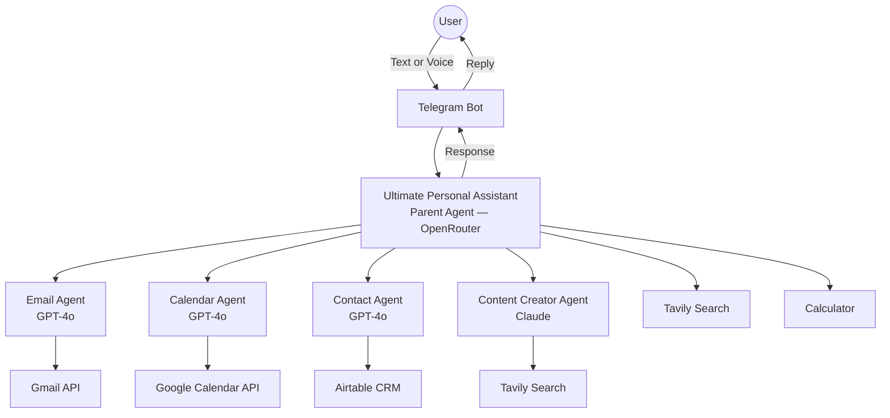
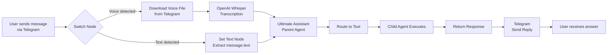
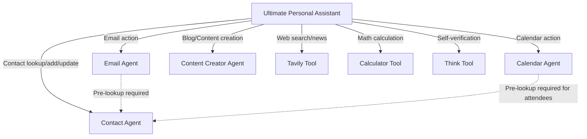
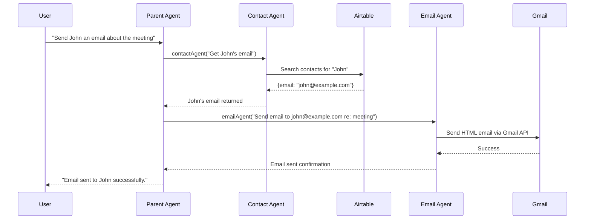
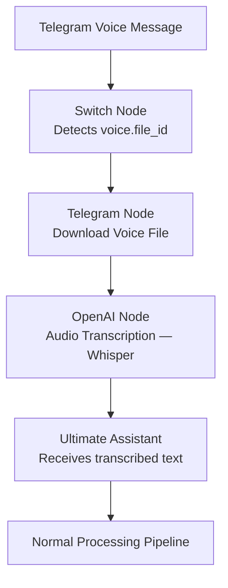
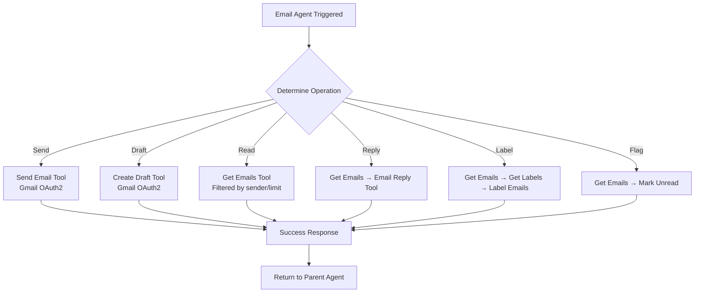
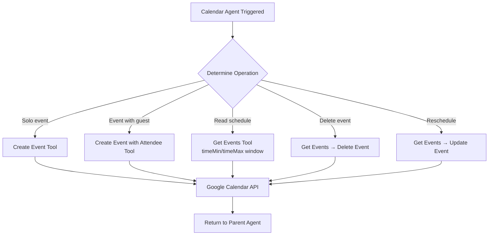

# 🤖 AgentOS — Your AI-Powered Personal Assistant

> **Automate your life. One message at a time.**
> A production-grade, multi-agent AI assistant built on n8n — handling email, calendar, contacts, content creation, and real-time web research via Telegram, voice, or text.

[](https://n8n.io)
[](https://github.com)
[](https://openrouter.ai)
[](https://openai.com)
[](https://anthropic.com)
[](https://telegram.org)
[](https://gmail.com)
[](https://calendar.google.com)
[](https://airtable.com)
[](https://tavily.com)
[](LICENSE)

---

## 📋 Table of Contents

- [Overview](#overview)
- [Features](#features)
- [Architecture](#architecture)
- [Tech Stack](#tech-stack)
- [Project Structure](#project-structure)
- [How It Works](#how-it-works)
- [Agent Documentation](#agent-documentation)
- [Installation Guide](#installation-guide)
- [Environment Variables](#environment-variables)
- [Integration Setup](#integration-setup)
- [Importing Workflows into n8n](#importing-workflows-into-n8n)
- [Example Commands](#example-commands)
- [Security Considerations](#security-considerations)
- [Troubleshooting](#troubleshooting)
- [Performance and Scalability](#performance-and-scalability)
- [Future Improvements](#future-improvements)
- [Portfolio Value](#portfolio-value)
- [Contributing](#contributing)
- [Acknowledgements](#acknowledgements)
- [License](#license)

---

## 🔍 Overview

**AgentOS** is a production-ready, multi-agent AI assistant system built with [n8n](https://n8n.io). It accepts natural language commands via Telegram — as text or voice messages — and intelligently delegates tasks to a suite of specialized AI sub-agents that manage your email, calendar, contacts, and content creation, while also providing real-time internet research.

### Why It Was Built

Managing digital life across Gmail, Google Calendar, Airtable, and various SaaS tools is fragmented and time-consuming. AgentOS eliminates context-switching by providing a single conversational interface — your Telegram bot — that understands intent and executes actions across all connected services autonomously.

### Real-World Use Cases

- A professional who wants to draft, send, and organize emails without opening Gmail
- A freelancer who needs to schedule meetings, add attendees, and reschedule events from a phone conversation
- A content creator who wants research-backed blog posts generated on demand
- A team lead who wants to look up contact details and fire off emails in one message
- Anyone who wants a personal AI assistant accessible from any device via Telegram

### Problems It Solves

- **Tool fragmentation** — One interface replaces manual interactions with four or more separate tools
- **Context loss** — Conversation memory ensures the assistant understands multi-turn requests
- **Manual coordination** — The parent agent automatically looks up contacts before sending emails or creating events with attendees, without the user having to provide details twice
- **Voice accessibility** — Telegram voice messages are transcribed and processed identically to text

---

## ✨ Features

### 🤖 AI Agent Orchestration

The **Ultimate Personal Assistant** serves as the parent orchestrator. It receives every user message and uses an OpenRouter-powered LLM to determine intent and route the request to the appropriate child agent tool. It never executes domain actions itself — it delegates exclusively. Before sending emails or scheduling meetings with attendees, it automatically calls the Contact Agent to resolve names to email addresses, then passes enriched context to the relevant child agent.

### 📧 Email Management

The Email Agent connects to Gmail via OAuth2 and supports the full lifecycle of email interaction:
- Composing and sending HTML-formatted emails
- Creating draft emails for review before sending
- Retrieving emails filtered by sender and quantity
- Replying to specific email threads
- Applying Gmail labels to organize messages
- Marking emails as unread for follow-up

### 📅 Calendar Management

The Calendar Agent integrates directly with Google Calendar and supports complete event lifecycle management:
- Creating solo events with automatic one-hour default duration
- Creating events with attendees (sends Google Calendar invitations)
- Retrieving scheduled events for a given date range
- Updating existing event times
- Deleting events by name (auto-resolves event ID internally)

### 👤 Contact Management

The Contact Agent uses Airtable as a personal CRM, enabling:
- Looking up contact information (name, email, phone)
- Adding new contacts to the database
- Updating existing contact records (upsert logic prevents duplicates)

### ✍️ Content Creation

The Content Creator Agent uses Anthropic Claude to produce well-structured, SEO-optimized blog posts:
- Searches Tavily for up-to-date information on the requested topic
- Formats output as semantic HTML with proper headings, paragraphs, lists, and citations
- Preserves source URLs as clickable hyperlinks
- Writes in a natural, human-like tone with varied sentence structure

### 🌐 Internet Research

The parent agent has direct access to Tavily's search API for general-purpose web queries:
- Fetches news and current events with up to 3 top results
- Returns raw content for deep answers
- Available both directly (for quick lookups) and via the Content Creator Agent (for blog research)

### 🎙️ Voice Assistant

AgentOS handles Telegram voice messages natively:
- Detects voice messages via the Switch node routing logic
- Downloads the audio file from Telegram's servers
- Transcribes it using OpenAI Whisper (via the `openAi` transcription node)
- Passes the transcribed text identically to the same processing pipeline as typed messages

### 🧠 Memory System

The parent agent uses a **Window Buffer Memory** node keyed to the Telegram `chat.id`. This means:
- Each user's conversation history is maintained per session
- The assistant can reference earlier context in multi-turn exchanges
- Memory resets when a new session begins (configurable window size)

### 🏗️ Multi-Agent Architecture

AgentOS implements a **parent-child workflow pattern** natively in n8n:
- The parent agent (`Ultimate Personal Assistant`) has five child agents registered as `toolWorkflow` nodes
- Each child agent is a fully independent n8n workflow triggered via `executeWorkflowTrigger`
- Child agents use different LLMs based on their task: OpenRouter for the orchestrator, GPT-4o for Email/Calendar/Contact agents, and Claude for the Content Creator
- All child agents implement graceful error handling with a fallback `Try Again` response path

---

## 🏛️ Architecture

### 1. High-Level Architecture Diagram



### 2. User Request Flow Diagram



### 3. Agent Routing Diagram



### 4. Tool Invocation Diagram



### 5. Voice Processing Flow Diagram



### 6. Email Workflow Diagram



### 7. Calendar Workflow Diagram



---

## 🛠️ Tech Stack

| Technology | Role | Details |
|------------|------|---------|
| **n8n** | Workflow Automation Engine | Self-hosted or cloud; orchestrates all agent workflows and node connections |
| **OpenRouter** | LLM Gateway (Parent Agent) | Routes to multiple LLM providers; used by the Ultimate Assistant orchestrator |
| **OpenAI GPT-4o** | LLM (Email, Calendar, Contact Agents) | High-capability model for structured task execution in sub-agents |
| **OpenAI Whisper** | Audio Transcription | Converts Telegram voice messages to text via the `openAi` transcription node |
| **Anthropic Claude** | LLM (Content Creator Agent) | Superior long-form writing and research synthesis for blog post generation |
| **Telegram Bot API** | User Interface & Voice Input | Triggers workflows on message/voice; delivers responses back to users |
| **Gmail (OAuth2)** | Email Operations | Send, draft, read, reply, label, and flag emails via Google's REST API |
| **Google Calendar (OAuth2)** | Calendar Operations | Create, read, update, and delete calendar events with attendee support |
| **Airtable** | Contact CRM | Stores and retrieves contact records (name, email, phone); upsert on name |
| **Tavily** | Real-Time Web Search | AI-optimized search API returning structured news results with raw content |
| **n8n Window Buffer Memory** | Conversation Memory | Maintains per-user session context keyed to Telegram chat ID |
| **n8n Think Tool** | Agent Reasoning | Internal scratchpad; called after every action to verify correctness |
| **n8n Calculator Tool** | Math Operations | Handles arithmetic and calculation requests directly in the parent agent |

---

## 📁 Project Structure

```
AgentOS/
├── workflows/
│   ├── agents/
│   │   ├── Ultimate_Personal_Assistant.json   # Parent orchestrator workflow
│   │   ├── _Email_Agent.json                  # Gmail management sub-agent
│   │   ├── _Calendar_Agent.json               # Google Calendar sub-agent
│   │   ├── _Contact_Agent.json                # Airtable CRM sub-agent
│   │   └── _Content_Creator_Agent.json        # Blog writing sub-agent
├── docs/
│   ├── architecture.md                        # Extended architecture notes
│   └── agent-reference.md                     # Agent API reference
├── .env.example                               # All required environment variables
└── README.md
```

---

## ⚙️ How It Works

**Step 1 — Telegram Receives the Message**

The workflow begins when a user sends a message (text or voice) to the Telegram bot. The `Telegram Trigger` node listens for all incoming `message` updates and fires the workflow.

**Step 2 — Voice/Text Routing**

A `Switch` node inspects the incoming payload. If `message.voice.file_id` exists, the message is routed to the voice processing branch. If `message.text` exists, it proceeds directly to the text branch.

**Step 3 — Audio Transcription (Voice Path)**

For voice messages, the `Download Voice File` node fetches the audio binary from Telegram's CDN using the file ID. The audio is then passed to the `Transcribe Audio` node, which calls OpenAI's Whisper API to convert speech to text.

**Step 4 — Parent AI Agent Processing**

The transcribed text (or typed text) arrives at the **Ultimate Assistant** agent. This agent is powered by OpenRouter and has access to a Window Buffer Memory component that maintains conversation history per Telegram chat ID. The agent analyzes the user's intent using its system prompt and decides which tool(s) to invoke.

**Step 5 — Tool Selection and Pre-Processing**

The parent agent applies routing logic. For email and calendar actions that require a recipient, it first calls the `contactAgent` tool to resolve a person's name to their email address. It then passes enriched context (including the resolved email) to the target child agent. The `Think` tool is called after every significant action to verify that the correct steps were taken.

**Step 6 — Child Workflow Execution**

The selected child agent workflow is triggered via n8n's `Execute Workflow` mechanism. Each sub-agent has its own LLM, dedicated tools, and error handling. The child agent executes the requested operation (e.g., sends the email via Gmail API) and returns a `response` field.

**Step 7 — Final Response Delivery**

The parent agent receives the child's response, formulates a natural language reply, and the `Response` node sends it back to the user via Telegram using the original `chat.id` as the target. The user sees the reply in their Telegram conversation.

---

## 📖 Agent Documentation

### Ultimate Personal Assistant (Parent Agent)

**Purpose:** Central AI orchestrator that interprets natural language, maintains context, and routes tasks to specialized child agents.

**LLM:** OpenRouter (model configurable via OpenRouter dashboard)

**Memory:** Window Buffer Memory — keyed to Telegram `chat.id`, ensuring per-user conversation continuity.

**Connected Tools:**

| Tool | Type | Description |
|------|------|-------------|
| `emailAgent` | Sub-workflow | All Gmail operations |
| `calendarAgent` | Sub-workflow | All Google Calendar operations |
| `contactAgent` | Sub-workflow | All Airtable contact operations |
| `contentCreator` | Sub-workflow | Blog post generation |
| `Tavily` | HTTP Tool | Direct web search |
| `Calculator` | Built-in | Arithmetic computation |
| `Think` | Built-in | Internal reasoning scratchpad |

**Routing Logic:** The agent reads its system prompt which enumerates each tool and its purpose. Intent classification is handled by the LLM — no hard-coded if/else routing. The agent uses chain-of-thought via the Think tool to validate its actions.

**Decision Making:** For contact-dependent actions (sending emails, drafting emails, creating events with attendees), the agent is instructed to always call `contactAgent` first to resolve names to emails before calling the target agent.

**Example Requests:**
- "Send an email to Sarah asking if she's free Friday"
- "What's on my calendar tomorrow?"
- "Search for the latest news on AI regulation"
- "Calculate 15% of 4,250"
- "Add Marcus Williams to my contacts, his email is marcus@email.com"

---

### Email Agent

**Purpose:** Manages all Gmail interactions — composing, sending, reading, replying, labeling, and flagging emails.

**LLM:** OpenAI GPT-4o

**Tools Used:**

| Tool | Gmail Operation |
|------|----------------|
| `Send Email` | `gmailTool` — sends an HTML email to a recipient |
| `Create Draft` | `gmailTool` — saves a draft without sending |
| `Get Emails` | `gmailTool` — retrieves emails by sender and count |
| `Email Reply` | `gmailTool` — replies to an existing email thread |
| `Get Labels` | `gmailTool` — lists all Gmail labels |
| `Label Emails` | `gmailTool` — applies a label to a message by ID |
| `Mark Unread` | `gmailTool` — marks a message as unread by ID |

**Supported Operations:** Send, draft, read, reply, label, mark unread

**Example Queries:**
- "Send a professional follow-up email to the client about the proposal"
- "Draft an email to the team about the Friday standup cancellation"
- "Get my last 5 emails from hr@company.com"
- "Reply to Jake's email saying I'll send the report by EOD"
- "Label the invoice email from accounting as 'Finance'"
- "Mark the email from my manager as unread"

---

### Calendar Agent

**Purpose:** Manages the full lifecycle of Google Calendar events including creation, retrieval, update, and deletion.

**LLM:** OpenAI GPT-4o

**Tools Used:**

| Tool | Calendar Operation |
|------|-------------------|
| `Create Event` | Creates a solo event (no attendees) |
| `Create Event with Attendee` | Creates an event and sends an invite to a guest |
| `Get Events` | Retrieves events within a date window |
| `Update Event` | Modifies start/end time of an existing event |
| `Delete Event` | Removes an event by ID (requires Get Events first) |

**Supported Operations:** Create, read, update, delete events; invite attendees

**Example Queries:**
- "Schedule a dentist appointment tomorrow at 10 AM"
- "Add a team sync on Thursday at 3 PM with john@company.com"
- "What do I have scheduled for next Monday?"
- "Move my 2 PM meeting to 4 PM"
- "Cancel my Friday gym session"

---

### Contact Agent

**Purpose:** Maintains a personal contact directory in Airtable, supporting lookup, creation, and update of contact records.

**LLM:** OpenAI GPT-4o

**Tools Used:**

| Tool | Airtable Operation |
|------|-------------------|
| `Get Contacts` | Searches the Contacts table for a record |
| `Add or Update Contact` | Upserts a contact record matching on `name` field |

**Supported Operations:** Look up, add, update contacts (name, email, phone)

**Example Queries:**
- "What's Sarah's email address?"
- "Add David Chen to my contacts, phone 555-1234, email david@domain.com"
- "Update Michael's phone number to 555-9876"
- "Find the email address for the HR manager"

---

### Content Creator Agent

**Purpose:** Generates well-researched, HTML-formatted blog posts on any topic by combining Tavily web search with Anthropic Claude's writing capabilities.

**LLM:** Anthropic Claude (via `lmChatAnthropic` node)

**Tools Used:**

| Tool | Purpose |
|------|---------|
| `Tavily` | Searches the web for up-to-date information on the blog topic |

**Supported Operations:** Full blog post generation with citations, HTML formatting, and SEO structure

**Output Format:** Semantic HTML with `<h1>`, `<h2>`, `<p>`, `<ul><li>`, and `<a href="">` citation links

**Example Queries:**
- "Write a blog post about the future of AI agents"
- "Create a 1000-word article on sustainable investing"
- "Write a technical blog about the differences between RAG and fine-tuning"
- "Generate a blog about the best productivity tools for remote teams"

---

## 🚀 Installation Guide

### Prerequisites

Before installing AgentOS, ensure you have:

- Node.js v18.17.0 or higher
- npm v9 or higher
- Git
- A Telegram account and BotFather access
- Google Cloud project with Gmail and Calendar APIs enabled
- OpenRouter, OpenAI, Anthropic, and Tavily API keys
- An Airtable account with a Contacts base

---

### Install n8n

**Windows:**
```bash
npm install -g n8n
n8n start
```

**Linux / macOS:**
```bash
npm install -g n8n
n8n start
```

**Docker (recommended for production):**
```bash
docker run -it --rm \
  --name n8n \
  -p 5678:5678 \
  -v ~/.n8n:/home/node/.n8n \
  n8nio/n8n
```

**Docker Compose:**

Create a `docker-compose.yml`:
```yaml
version: "3"
services:
  n8n:
    image: n8nio/n8n
    restart: always
    ports:
      - "5678:5678"
    environment:
      - N8N_HOST=localhost
      - N8N_PORT=5678
      - N8N_PROTOCOL=http
      - WEBHOOK_URL=http://localhost:5678
    volumes:
      - n8n_data:/home/node/.n8n

volumes:
  n8n_data:
```

```bash
docker-compose up -d
```

Access n8n at `http://localhost:5678`.

---

## 🔑 Environment Variables

Create a `.env` file in your n8n data directory (or configure via the n8n UI under **Settings → Credentials**):

| Variable | Description | Required |
|----------|-------------|----------|
| `OPENROUTER_API_KEY` | API key from OpenRouter — used by the parent orchestrator agent | ✅ |
| `OPENAI_API_KEY` | API key from OpenAI — used by Email, Calendar, Contact agents and Whisper transcription | ✅ |
| `ANTHROPIC_API_KEY` | API key from Anthropic — used by the Content Creator Agent (Claude) | ✅ |
| `TAVILY_API_KEY` | API key from Tavily — used for web search in parent agent and Content Creator | ✅ |
| `TELEGRAM_BOT_TOKEN` | Bot token from BotFather — authenticates your Telegram bot | ✅ |
| `GMAIL_OAUTH_CLIENT_ID` | Google OAuth2 Client ID for Gmail API access | ✅ |
| `GMAIL_OAUTH_CLIENT_SECRET` | Google OAuth2 Client Secret for Gmail API access | ✅ |
| `GOOGLE_CALENDAR_CLIENT_ID` | Google OAuth2 Client ID for Calendar API access (can share with Gmail) | ✅ |
| `GOOGLE_CALENDAR_CLIENT_SECRET` | Google OAuth2 Client Secret for Calendar API access | ✅ |
| `AIRTABLE_API_KEY` | Airtable Personal Access Token with read/write access to your Contacts base | ✅ |
| `AIRTABLE_BASE_ID` | The base ID of your Airtable Contacts database (format: `appXXXXXXXXX`) | ✅ |

**`.env.example`:**
```env
OPENROUTER_API_KEY=sk-or-...
OPENAI_API_KEY=sk-...
ANTHROPIC_API_KEY=sk-ant-...
TAVILY_API_KEY=tvly-...
TELEGRAM_BOT_TOKEN=123456:ABC-...
GMAIL_OAUTH_CLIENT_ID=xxxx.apps.googleusercontent.com
GMAIL_OAUTH_CLIENT_SECRET=GOCSPX-...
GOOGLE_CALENDAR_CLIENT_ID=xxxx.apps.googleusercontent.com
GOOGLE_CALENDAR_CLIENT_SECRET=GOCSPX-...
AIRTABLE_API_KEY=patXXXXXXXXXXXXXX
AIRTABLE_BASE_ID=appXXXXXXXXX
```

---

## 🔌 Integration Setup

### Telegram Bot Setup

1. Open Telegram and search for `@BotFather`
2. Send `/newbot` and follow the prompts to name your bot
3. BotFather will provide a `TELEGRAM_BOT_TOKEN` — copy it
4. In n8n, go to **Credentials → Add Credential → Telegram API**
5. Paste your bot token and save
6. In the `Telegram Trigger` node, select your saved credential
7. Activate the workflow — n8n registers the webhook automatically

### OpenRouter Setup

1. Create an account at [openrouter.ai](https://openrouter.ai)
2. Navigate to **Keys** and generate a new API key
3. In n8n, go to **Credentials → Add Credential → OpenRouter API**
4. Enter your API key
5. Select your preferred model in the `OpenRouter Chat Model` node (e.g., `anthropic/claude-3.5-sonnet`, `google/gemini-pro`)

### Gmail OAuth Setup

1. Go to [Google Cloud Console](https://console.cloud.google.com)
2. Create a new project or select an existing one
3. Navigate to **APIs & Services → Library** and enable the **Gmail API**
4. Go to **APIs & Services → Credentials → Create Credentials → OAuth 2.0 Client ID**
5. Set Application Type to **Web Application**
6. Add `http://localhost:5678/rest/oauth2-credential/callback` as an Authorized Redirect URI
7. Download the credentials JSON — note the Client ID and Client Secret
8. In n8n, go to **Credentials → Add Credential → Gmail OAuth2 API**
9. Enter Client ID and Client Secret, then click **Connect** and authorize with your Google account

### Google Calendar Setup

1. In the same Google Cloud project, enable the **Google Calendar API**
2. You can reuse the same OAuth2 credentials created for Gmail
3. In n8n, go to **Credentials → Add Credential → Google Calendar OAuth2 API**
4. Enter the same Client ID and Client Secret
5. Authorize with the Google account whose calendar you want to manage

### Airtable Setup

1. Go to [airtable.com](https://airtable.com) and create a new base named **Contacts**
2. Create a table named **Contacts** with three fields: `name` (Single line text), `email` (Email), `phoneNumber` (Phone number)
3. Navigate to [airtable.com/create/tokens](https://airtable.com/create/tokens) and create a Personal Access Token
4. Grant scopes: `data.records:read`, `data.records:write`, `schema.bases:read`
5. Grant access to your Contacts base
6. Copy the base ID from the URL: `airtable.com/appXXXXXXX/...`
7. In n8n, go to **Credentials → Add Credential → Airtable API**
8. Enter your Personal Access Token

### Tavily Setup

1. Create an account at [tavily.com](https://tavily.com)
2. Navigate to your dashboard and copy your API key
3. Replace `"api_key": "your-api-key"` in both the parent agent's Tavily HTTP Tool node and the Content Creator Agent's Tavily node with your actual key
4. Alternatively, store it as an n8n credential and reference it via expression

### Anthropic Setup

1. Create an account at [console.anthropic.com](https://console.anthropic.com)
2. Navigate to **API Keys** and create a new key
3. In n8n, go to **Credentials → Add Credential → Anthropic API**
4. Enter your API key
5. The Content Creator Agent's `Anthropic Chat Model` node will use this credential

### OpenAI Setup

1. Create an account at [platform.openai.com](https://platform.openai.com)
2. Navigate to **API Keys** and create a new key
3. In n8n, go to **Credentials → Add Credential → OpenAI API**
4. Enter your API key
5. This credential is used by the Email Agent, Calendar Agent, Contact Agent (all using GPT-4o), and the audio transcription node (Whisper)

---

## 📥 Importing Workflows into n8n

### Step 1 — Import Workflow Files

1. Open n8n at `http://localhost:5678`
2. Click **New Workflow** or navigate to **Workflows**
3. Click the **⋮** menu (top right) → **Import from File**
4. Import each JSON file in the following order:
   - `_Email_Agent.json`
   - `_Calendar_Agent.json`
   - `_Contact_Agent.json`
   - `_Content_Creator_Agent.json`
   - `Ultimate_Personal_Assistant.json` (import last — it references the others)

### Step 2 — Connect Credentials

After importing each workflow:

1. Open the workflow
2. Click on each node that shows a credential warning (highlighted in orange/red)
3. Select or create the appropriate credential from the dropdown
4. Save the workflow

### Step 3 — Update Workflow IDs in Parent Agent

The parent agent references child workflows by their n8n workflow ID. After importing sub-agents:

1. Note the URL of each sub-agent workflow: `http://localhost:5678/workflow/WORKFLOW_ID`
2. Open the `Ultimate_Personal_Assistant` workflow
3. Click each sub-agent tool node (`Email Agent`, `Calendar Agent`, `Contact Agent`, `Content Creator Agent`)
4. Update the `Workflow ID` field to match the imported workflow's ID
5. Save

### Step 4 — Activate Workflows

Activate workflows in this order:
1. Activate all four child agent workflows first
2. Activate `Ultimate_Personal_Assistant` last

To activate: open the workflow → toggle the **Active** switch (top right) to ON.

### Step 5 — Testing

1. Open Telegram and find your bot
2. Send a text message: `"What's today's date?"`
3. The bot should respond within 5–10 seconds
4. Test voice: record a voice message saying `"Search for the latest AI news"`
5. Test email: `"Draft an email to test@example.com with subject Test and body Hello World"`
6. Check n8n **Executions** tab to inspect node-by-node execution logs

---

## 💬 Example Commands

| Category | Example Command |
|----------|----------------|
| **Email** | "Send an email to John asking for the project update" |
| **Email** | "Draft a follow-up email to the client about the invoice" |
| **Email** | "Get my last 3 emails from boss@company.com" |
| **Email** | "Reply to Sarah's email and tell her the meeting is confirmed" |
| **Email** | "Label the email from billing as 'Finance'" |
| **Email** | "Mark the email from HR as unread" |
| **Email** | "Write a professional apology email to the client for the delay" |
| **Calendar** | "Schedule a dentist appointment tomorrow at 9 AM" |
| **Calendar** | "Add a team standup on Monday at 10 AM with alice@work.com" |
| **Calendar** | "What meetings do I have this Friday?" |
| **Calendar** | "Move my 3 PM call to 5 PM" |
| **Calendar** | "Cancel my gym session on Wednesday" |
| **Calendar** | "Schedule a 2-hour product review on Thursday at 2 PM" |
| **Calendar** | "Do I have anything scheduled for next Tuesday?" |
| **Contacts** | "What's Emily's email address?" |
| **Contacts** | "Add Daniel Park to my contacts, email daniel@example.com, phone 555-0101" |
| **Contacts** | "Update Sarah's phone number to 555-2222" |
| **Contacts** | "Find the contact info for my accountant" |
| **Content** | "Write a blog post about the rise of AI agents in 2025" |
| **Content** | "Create a 1000-word article on remote work productivity tips" |
| **Content** | "Write a technical blog comparing LangChain and n8n for AI workflows" |
| **Content** | "Generate a blog post about the future of electric vehicles" |
| **Search** | "What's the latest news on the US stock market?" |
| **Search** | "Search for recent developments in quantum computing" |
| **Search** | "What happened in AI this week?" |
| **Search** | "Find news about SpaceX's latest launch" |
| **Math** | "What is 18% of 3,450?" |
| **Math** | "Calculate compound interest on $10,000 at 7% for 5 years" |
| **Multi-step** | "Send an email to Michael about tomorrow's standup and add it to my calendar" |
| **Multi-step** | "Look up Jake's email and schedule a lunch meeting with him on Friday at noon" |
| **Voice** | (Record voice) "Remind me to send the report by adding it to my calendar at 4 PM today" |

---

## 🔒 Security Considerations

### Credential Management

- Never hardcode API keys directly in workflow JSON files — use n8n's built-in Credential system, which encrypts values at rest using AES-256
- Rotate API keys periodically and update them in n8n credentials without modifying workflow files
- Use environment variables (`N8N_ENCRYPTION_KEY`) to set a custom encryption key for your n8n instance

### API Key Protection

- Restrict Tavily API keys to specific IP addresses if your n8n instance has a static IP
- Set spending limits on OpenRouter, OpenAI, and Anthropic accounts to prevent runaway costs
- Use read-only API scopes where possible (e.g., create a separate Airtable token with only the permissions needed)

### OAuth Handling

- Gmail and Google Calendar credentials use OAuth2, meaning no passwords are stored — only refresh tokens managed by n8n
- Set OAuth token expiry reminders — Google refresh tokens can expire after 6 months of inactivity
- Use a dedicated Google account for the assistant rather than your personal account, to contain access scope

### Best Practices

- Run n8n behind a reverse proxy (Nginx/Caddy) with TLS if exposing it publicly
- Set `N8N_BASIC_AUTH_ACTIVE=true` and configure a strong password on your n8n instance
- Restrict Telegram bot access to only your Telegram user ID by adding a filter node that checks `message.chat.id` against an allowlist
- Regularly review n8n execution logs and audit which workflows accessed which external APIs

---

## 🛠️ Troubleshooting

| Problem | Likely Cause | Solution |
|---------|-------------|----------|
| Telegram bot not responding | Workflow is inactive | Activate the `Ultimate_Personal_Assistant` workflow in n8n |
| "Webhook not registered" error | n8n URL mismatch | Set `WEBHOOK_URL` environment variable to your n8n's public URL |
| Voice messages not transcribed | Missing OpenAI credential | Connect an OpenAI credential to the `Transcribe Audio` node |
| Agent returns "I don't know" | OpenRouter model not set | Select a model in the `OpenRouter Chat Model` node configuration |
| Email not sent | Gmail credential expired | Re-authorize the Gmail OAuth2 credential in n8n Settings |
| Calendar event not created | Wrong calendar selected | Verify the calendar ID in the `Create Event` node matches your Google account |
| Contact not found in Airtable | Base/table ID mismatch | Update the `base` and `table` fields in the Airtable tool nodes with your actual IDs |
| Child agent not triggered | Wrong workflow ID | Update sub-agent workflow IDs in the parent agent's tool nodes |
| "Try Again" response from child agent | LLM error or tool failure | Check the child workflow execution log for the specific error |
| Tavily returning no results | Invalid or expired API key | Replace the Tavily `api_key` in the HTTP Tool node body |
| Content Creator produces plain text | Anthropic credential missing | Add an Anthropic credential to the `Anthropic Chat Model` node |
| Memory not persisting between messages | Session key mismatch | Verify the `Simple Memory` node uses `$('Telegram Trigger').item.json.message.chat.id` as session key |
| Parent agent calls wrong tool | Ambiguous user query | Rephrase the request more explicitly, e.g., "Send an *email*" instead of "Message John" |
| OAuth2 "redirect_uri_mismatch" | Incorrect redirect URI | Add `http://localhost:5678/rest/oauth2-credential/callback` to Google Cloud Console authorized URIs |
| n8n Docker container not starting | Port conflict | Change the `-p 5678:5678` mapping to an unused port |
| Airtable upsert creating duplicates | Name field mismatch | Ensure the `matchingColumns` field is set to `["name"]` in the Airtable upsert node |
| Agent stuck in tool loop | Think tool not terminating | Ensure the system prompt instructs the agent to stop after verification |
| Gmail "Quota exceeded" | Too many API calls | Implement rate limiting or upgrade Google Cloud API quota |
| Calendar attendee invite not sent | Missing attendee email | Ensure Contact Agent is called first to resolve the attendee's email |
| OpenRouter rate limit hit | High request volume | Upgrade OpenRouter plan or add retry logic between calls |
| n8n execution timeout | Long-running LLM calls | Increase `EXECUTIONS_TIMEOUT` in n8n environment variables |
| Blog post has no citations | Tavily returned no results | Try a more specific or differently worded search query |

---

## 📈 Performance and Scalability

### Current Architecture

AgentOS runs as a single n8n instance with synchronous workflow execution. Each Telegram message triggers one execution chain that may span multiple LLM API calls (parent agent reasoning + child agent tool calls). Average end-to-end latency for a simple request is 3–8 seconds, and 10–20 seconds for content creation tasks that involve web search and long-form generation.

### Current Limitations

- **Single-user design:** The Telegram bot does not restrict access by user ID, meaning anyone with the bot link can send commands. The memory system is per `chat.id`, but API costs are shared.
- **Sequential tool calls:** Multi-step requests (e.g., lookup contact, then send email) are executed sequentially, not in parallel.
- **Stateless child agents:** Sub-agents have no memory — they operate only on the query passed by the parent.
- **No queue management:** High message volume can overwhelm a single n8n instance.

### Scaling Recommendations

- Add a user allowlist check immediately after the Telegram Trigger to restrict access to authorized chat IDs
- Deploy n8n with a PostgreSQL backend (replace the default SQLite) for higher concurrent execution throughput
- Use n8n's built-in queue mode with a Redis instance for high-volume scenarios
- Cache Tavily search results in Airtable or Redis to reduce API costs for repeated queries
- Distribute child agents across separate n8n instances for parallel execution

### Production Deployment Suggestions

- Host n8n on a VPS (e.g., DigitalOcean, Hetzner) with at least 2 vCPU and 4 GB RAM
- Use Caddy or Nginx as a reverse proxy with automatic HTTPS
- Set up PM2 or systemd to keep n8n running as a background service
- Enable n8n execution data pruning to prevent database bloat (`EXECUTIONS_DATA_PRUNE=true`)
- Monitor API costs on all provider dashboards and set billing alerts

---

## 🔮 Future Improvements

1. **WhatsApp Integration** — Add a WhatsApp Cloud API trigger as an alternative interface alongside Telegram
2. **Slack Integration** — Connect to Slack as both an input interface and a notification output channel
3. **RAG Memory System** — Replace the window buffer with a vector-based memory (Pinecone + embeddings) for long-term, semantic recall of past conversations
4. **Multi-user Support** — Add authentication layer with per-user API key isolation and cost tracking
5. **MCP Tool Integration** — Connect n8n to Model Context Protocol servers for richer tool ecosystems
6. **Voice Response (TTS)** — Return audio voice replies to Telegram using OpenAI TTS API
7. **Notion Integration** — Add a Notion agent for note-taking, database management, and knowledge base queries
8. **Proactive Reminders** — Add a cron-triggered workflow that checks the calendar and sends morning briefings via Telegram
9. **File Processing** — Accept PDF/document uploads in Telegram and extract, summarize, or analyze content
10. **Image Generation** — Integrate DALL-E or Stable Diffusion for image creation as part of content production
11. **Spotify / Music Control** — Add a media control agent for playback management
12. **GitHub Integration** — Add a developer agent that can create issues, check PR status, and summarize commit activity
13. **Multi-language Support** — Add language detection and respond in the user's native language
14. **Task Manager Integration** — Connect to Todoist or Notion for task creation from natural language
15. **Smart Email Triage** — A scheduled workflow that auto-labels, prioritizes, and summarizes the inbox daily
16. **Analytics Dashboard** — Build a simple dashboard showing command frequency, API usage, and response times
17. **Webhook Intake** — Accept incoming webhooks from Stripe, GitHub, or forms and process them with AI
18. **Database Agent** — Add a SQL agent for querying internal databases via natural language
19. **Cost Optimization Layer** — Route simpler queries to cheaper models and complex queries to premium LLMs automatically
20. **Agent Evaluation Harness** — Add test workflows that verify agent responses against expected outputs for regression testing

---

## 🎓 Portfolio Value

AgentOS demonstrates a broad range of high-demand engineering skills:

| Skill Area | What This Project Demonstrates |
|-----------|-------------------------------|
| **AI Agent Design** | Parent-child orchestration pattern with LLM-based intent routing and tool use |
| **Prompt Engineering** | Carefully crafted system prompts for each specialized agent with clear rules and examples |
| **LLM Orchestration** | Multi-provider LLM usage (OpenRouter, OpenAI GPT-4o, Anthropic Claude, OpenAI Whisper) |
| **Workflow Automation** | Production n8n workflow design with error handling, branching, and sub-workflow composition |
| **API Integration** | OAuth2 (Gmail, Google Calendar), REST APIs (Telegram, Airtable, Tavily) |
| **System Design** | Modular, extensible multi-agent architecture with clean separation of concerns |
| **Voice AI** | End-to-end voice pipeline: Telegram audio → Whisper transcription → LLM → response |
| **Memory Systems** | Conversation context management with session-keyed window buffer memory |
| **Error Handling** | Graceful fallback paths in every sub-agent to prevent silent failures |
| **DevOps Awareness** | Docker deployment, environment variable management, credential security |
| **Technical Documentation** | Professional README, architecture diagrams, and agent reference documentation |

---

## 🤝 Contributing

Contributions are welcome. To contribute to AgentOS:

1. Fork the repository
2. Create a feature branch: `git checkout -b feature/your-feature-name`
3. Make your changes and test thoroughly using n8n's built-in test execution
4. Commit your changes: `git commit -m "feat: add WhatsApp integration trigger"`
5. Push to your fork: `git push origin feature/your-feature-name`
6. Open a Pull Request with a clear description of what was changed and why

**Contribution Guidelines:**
- Each new agent should be a standalone workflow JSON exportable from n8n
- Follow the existing naming convention: `_AgentName.json` for sub-agents
- Update the `Ultimate_Personal_Assistant` workflow and README when adding new agents
- Test all tool connections before submitting
- Do not commit real API keys or credentials

**Reporting Issues:**
- Use GitHub Issues with the label `bug`, `enhancement`, or `question`
- Include the n8n version, OS, and the full execution error from the n8n Executions panel

---

## 🙏 Acknowledgements

- **[n8n](https://n8n.io)** — The open-source workflow automation platform that makes this entire architecture possible
- **[OpenRouter](https://openrouter.ai)** — Unified LLM gateway providing flexible model access for the orchestrator
- **[OpenAI](https://openai.com)** — GPT-4o for structured task execution in sub-agents, and Whisper for voice transcription
- **[Anthropic](https://anthropic.com)** — Claude for superior long-form writing in the Content Creator Agent
- **[Telegram](https://telegram.org)** — Reliable, free bot platform providing both text and voice message interfaces
- **[Tavily](https://tavily.com)** — AI-optimized search API providing real-time, structured web results
- **[Airtable](https://airtable.com)** — Flexible no-code database used as the personal CRM backend

---

## 📄 License

```
MIT License

Copyright (c) 2025 AgentOS Contributors

Permission is hereby granted, free of charge, to any person obtaining a copy
of this software and associated documentation files (the "Software"), to deal
in the Software without restriction, including without limitation the rights
to use, copy, modify, merge, publish, distribute, sublicense, and/or sell
copies of the Software, and to permit persons to whom the Software is
furnished to do so, subject to the following conditions:

The above copyright notice and this permission notice shall be included in all
copies or substantial portions of the Software.

THE SOFTWARE IS PROVIDED "AS IS", WITHOUT WARRANTY OF ANY KIND, EXPRESS OR
IMPLIED, INCLUDING BUT NOT LIMITED TO THE WARRANTIES OF MERCHANTABILITY,
FITNESS FOR A PARTICULAR PURPOSE AND NONINFRINGEMENT. IN NO EVENT SHALL THE
AUTHORS OR COPYRIGHT HOLDERS BE LIABLE FOR ANY CLAIM, DAMAGES OR OTHER
LIABILITY, WHETHER IN AN ACTION OF CONTRACT, TORT OR OTHERWISE, ARISING FROM,
OUT OF OR IN CONNECTION WITH THE SOFTWARE OR THE USE OR OTHER DEALINGS IN THE
SOFTWARE.
```

---

<p align="center">
  Built with n8n · OpenRouter · GPT-4o · Claude · Telegram · Gmail · Google Calendar · Airtable · Tavily
</p>
