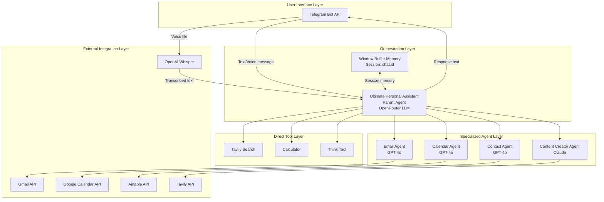
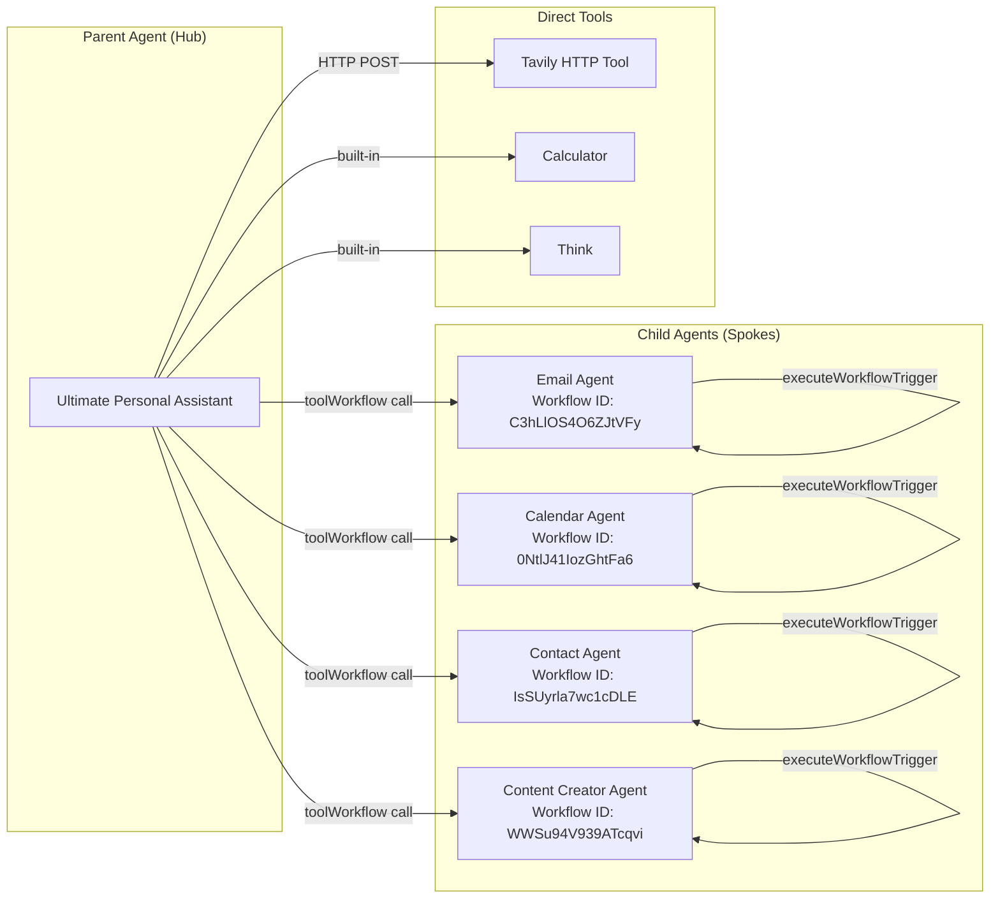
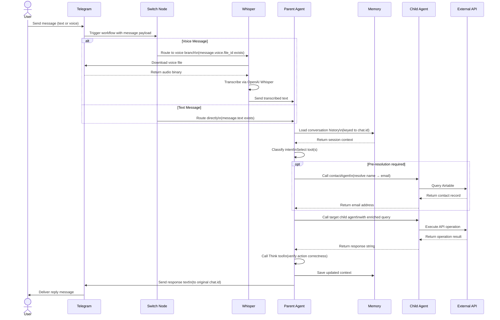
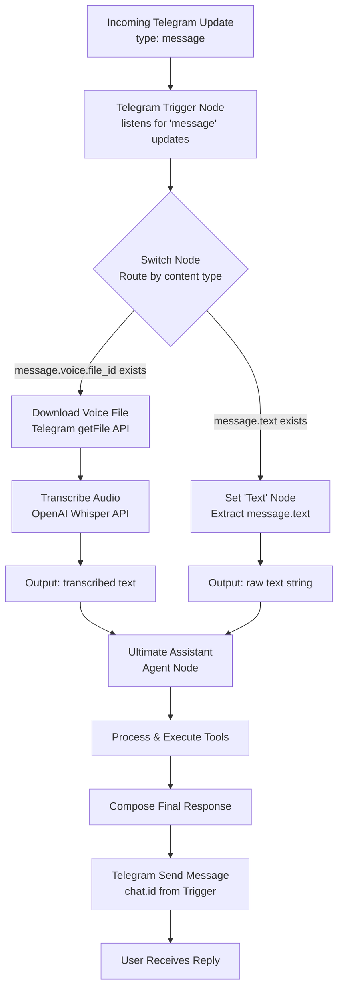
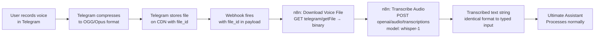
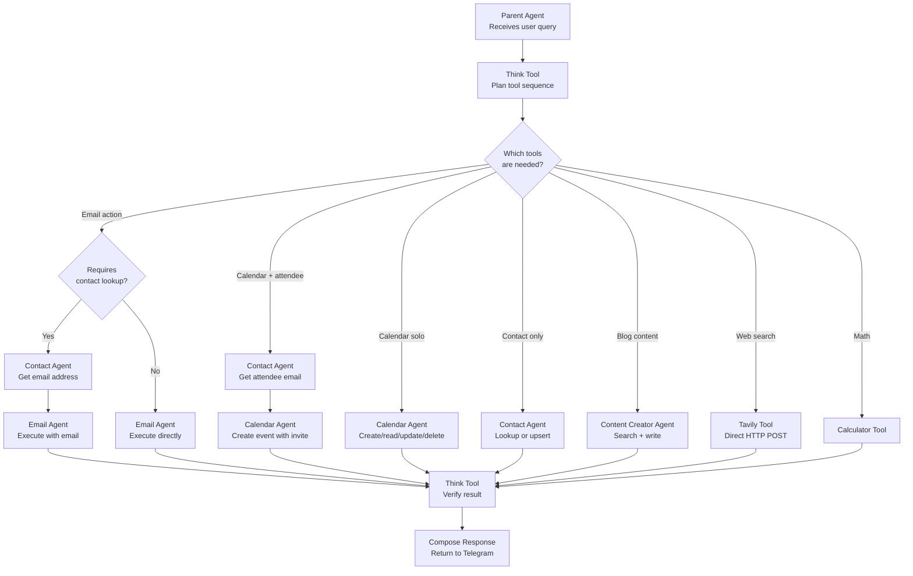
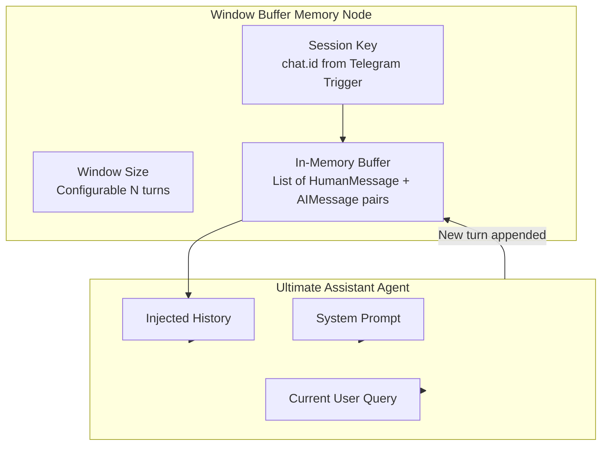
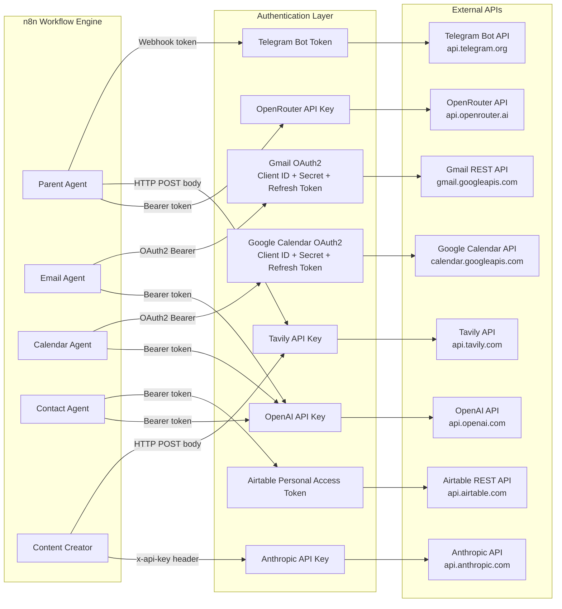
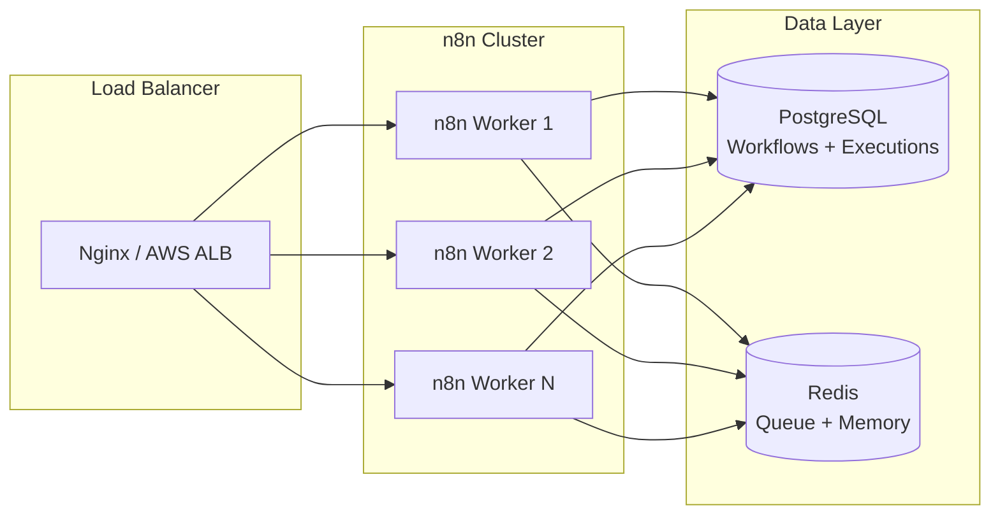
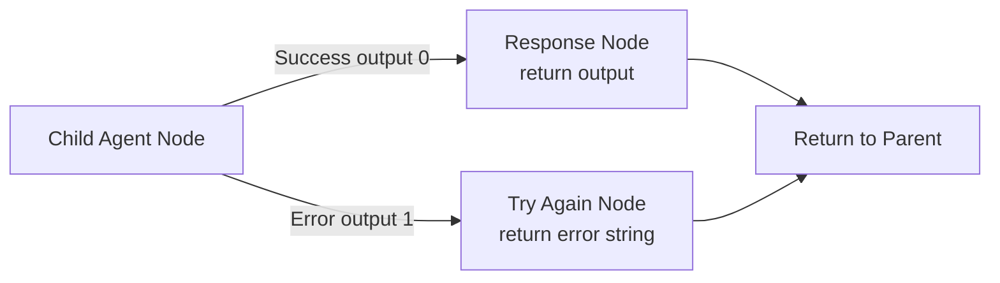

# AgentOS — System Architecture

> Technical architecture documentation for the AgentOS multi-agent AI assistant platform.

---

## Table of Contents

- [System Overview](#system-overview)
- [Design Goals](#design-goals)
- [Architecture Principles](#architecture-principles)
- [High-Level Architecture](#high-level-architecture)
- [Multi-Agent Architecture](#multi-agent-architecture)
- [Parent Agent Responsibilities](#parent-agent-responsibilities)
- [Child Agent Responsibilities](#child-agent-responsibilities)
- [Request Lifecycle](#request-lifecycle)
- [Telegram Message Flow](#telegram-message-flow)
- [Voice Processing Flow](#voice-processing-flow)
- [Tool Invocation Flow](#tool-invocation-flow)
- [Memory Architecture](#memory-architecture)
- [API Integration Architecture](#api-integration-architecture)
- [Security Architecture](#security-architecture)
- [Scalability Considerations](#scalability-considerations)
- [Failure Handling](#failure-handling)
- [Future Architecture Improvements](#future-architecture-improvements)

---

## System Overview

AgentOS is a multi-agent AI orchestration system implemented as a set of interconnected n8n workflows. The system accepts natural language input from a user via Telegram (text or voice), routes the intent through a parent orchestrator agent, delegates execution to one or more specialized child agents, and returns a natural language response to the user.

The system integrates with five external service categories:

- **AI Providers:** OpenRouter (parent LLM), OpenAI GPT-4o (sub-agent LLMs), Anthropic Claude (content generation), OpenAI Whisper (transcription)
- **Communication:** Telegram Bot API (user interface)
- **Productivity:** Gmail, Google Calendar
- **Data:** Airtable (CRM)
- **Research:** Tavily (web search)

All orchestration, routing, and execution logic lives inside n8n workflows. There is no custom backend code — the system is entirely declarative, making it auditable, reproducible, and portable.

---

## Design Goals

| Goal | Description |
|------|-------------|
| **Single Interface** | One Telegram bot as the sole user-facing entry point for all capabilities |
| **Specialization** | Each domain (email, calendar, contacts, content) is handled by a dedicated agent with focused tooling |
| **Modularity** | Child agents are independently importable, testable, and replaceable without modifying the parent |
| **Resilience** | Every sub-agent has a graceful error fallback path that never silently drops user requests |
| **Context Continuity** | Conversation memory is maintained per user session via Telegram chat ID |
| **LLM Flexibility** | Different LLMs are used per agent based on capability requirements; the parent uses a gateway (OpenRouter) to remain model-agnostic |
| **Zero Custom Code** | No custom application servers, databases, or middleware — fully implemented in n8n |

---

## Architecture Principles

**1. Hierarchical Delegation**
The parent agent never executes domain actions directly. All actions are delegated to child agents via n8n's `toolWorkflow` mechanism. This enforces a clean separation between orchestration logic and execution logic.

**2. Intent-Driven Routing**
Routing decisions are made by the LLM based on natural language understanding of the user's message and the tool descriptions provided in the system prompt. There are no hard-coded conditional branches for routing.

**3. Pre-Resolution Pattern**
For actions that require external identifiers (contact emails before sending email, event IDs before deleting calendar events), the system follows a mandatory pre-resolution step: the required identifier is fetched from the appropriate source before the primary action is executed.

**4. Stateless Sub-Agents**
Child agents are stateless — they receive a complete, self-contained `query` string from the parent and return a `response` string. They hold no cross-request state and can be executed in any order without side effects on each other.

**5. Error Boundary Per Agent**
Each child agent declares an `onError: continueErrorOutput` setting, routing LLM and tool failures to a dedicated error output branch. The parent always receives a response — either the result or a standardized error message — preventing execution halts.

---

## High-Level Architecture



---

## Multi-Agent Architecture

AgentOS implements a **hub-and-spoke multi-agent pattern**. The parent agent is the hub; each child agent is a spoke. Communication between hub and spokes uses n8n's native sub-workflow execution (`toolWorkflow` nodes), which passes a structured `query` string to the child and receives a `response` string back.



Each child workflow is triggered via n8n's `Execute Workflow` mechanism using `inputSource: passthrough`, meaning the full input data item is passed directly to the child workflow's trigger node without transformation.

---

## Parent Agent Responsibilities

The Ultimate Personal Assistant (parent agent) is responsible for:

1. **Input normalization** — Receiving either transcribed voice text or raw text message content from Telegram
2. **Intent classification** — Using the LLM to determine which tool(s) are needed for the user's request
3. **Pre-resolution orchestration** — Identifying when contact lookup is required before another action and sequencing tool calls accordingly
4. **Tool dispatch** — Invoking the correct child agent(s) or direct tool(s) with an appropriately formed query
5. **Response composition** — Receiving tool outputs and composing a final natural language response for the user
6. **Self-verification** — Calling the Think tool after every significant action sequence to verify correctness
7. **Memory management** — Maintaining per-session conversation context via the Window Buffer Memory node

The parent agent's system prompt explicitly prohibits it from executing email drafting, summarization, or domain-specific actions directly — it must always delegate.

---

## Child Agent Responsibilities

Each child agent is responsible for:

1. **Receiving a structured query** from the parent agent via the `executeWorkflowTrigger` passthrough
2. **Interpreting domain-specific intent** using its own LLM instance and specialized system prompt
3. **Selecting and invoking the correct tools** from its available tool set (Gmail, Google Calendar, Airtable, Tavily)
4. **Handling multi-step internal sequences** where required (e.g., Calendar Agent fetching event ID before deleting)
5. **Returning a structured response** — either `{ response: <output> }` on success or `{ response: "error message" }` on failure
6. **Graceful error handling** — routing LLM errors or tool failures to the `Try Again` output branch

| Agent | LLM | Primary Tools | Error Path |
|-------|-----|--------------|-----------|
| Email Agent | GPT-4o | Gmail (7 operations) | `Try Again` node |
| Calendar Agent | GPT-4o | Google Calendar (5 operations) | `Try Again` node |
| Contact Agent | GPT-4o | Airtable (2 operations) | `Try Again` node |
| Content Creator Agent | Claude | Tavily + Claude LLM | `Try Again` node |

---

## Request Lifecycle



---

## Telegram Message Flow



The Switch node uses strict type validation. The `Voice` output fires when `message.voice.file_id` is a non-empty string. The `Text` output fires when `message.text` is a non-empty string. Messages that match neither (stickers, files, etc.) are silently dropped in the current implementation.

---

## Voice Processing Flow



Voice processing adds approximately 2–4 seconds of latency compared to text input. The Whisper API supports multiple languages automatically and will transcribe in the detected language.

---

## Tool Invocation Flow



---

## Memory Architecture

The memory system uses n8n's built-in `memoryBufferWindow` component, which implements an in-memory sliding window of conversation turns.



**Key properties:**

- **Session isolation:** Each Telegram `chat.id` maintains an independent buffer. Two different users will never share conversation context.
- **Window eviction:** Older turns are evicted when the window size is exceeded, keeping memory consumption bounded.
- **Persistence scope:** The buffer lives in n8n's process memory. Restarting n8n clears all session history. For persistent memory across restarts, a database-backed memory store (e.g., Redis or PostgreSQL) should replace the buffer window.
- **No cross-agent memory:** Child agents do not share or access the conversation memory. Only the parent agent has memory context.

---

## API Integration Architecture



All credentials are stored encrypted in n8n's credential store and referenced by credential ID in workflow nodes. No secrets appear in workflow JSON files when credentials are properly configured.

---

## Security Architecture

```mermaid
graph TD
    subgraph Perimeter["Network Perimeter"]
        RP[Reverse Proxy\nNginx / Caddy]
        TLS[TLS Termination\nLet's Encrypt]
    end

    subgraph n8nLayer["n8n Application Layer"]
        BA[Basic Auth\nor API Key Auth]
        CE[Credential Encryption\nAES-256 at rest]
        WH[Webhook Endpoint\n/webhook/...UUID...]
    end

    subgraph BotLayer["Telegram Bot Layer"]
        TG_WH[Telegram Webhook\nHTTPS only]
        UID[User ID Filtering\n(recommended addition)]
    end

    Internet --> RP
    RP --> TLS
    TLS --> BA
    BA --> CE
    TLS --> WH
    WH --> TG_WH
    TG_WH --> UID
```

**Security controls in the current implementation:**

- Credentials stored encrypted in n8n's internal database
- Telegram webhook requires HTTPS; Telegram will not deliver to plain HTTP endpoints
- OAuth2 tokens are managed by n8n and automatically refreshed
- No user authentication or allowlisting is implemented at the bot level (recommended addition)

**Recommended hardening steps:**

1. Add a Telegram `chat.id` allowlist check immediately after the Telegram Trigger node
2. Run n8n behind Nginx or Caddy with TLS enabled
3. Enable n8n basic auth (`N8N_BASIC_AUTH_ACTIVE=true`)
4. Set a strong custom encryption key (`N8N_ENCRYPTION_KEY`)
5. Restrict outbound network access from the n8n host to only required API domains
6. Enable API key spending limits on all AI provider accounts

---

## Scalability Considerations

| Dimension | Current State | Bottleneck | Mitigation |
|-----------|-------------|-----------|-----------|
| **Concurrent users** | Single n8n worker | One execution per trigger | n8n queue mode + Redis |
| **Memory per session** | In-process buffer | Lost on restart | Redis/PostgreSQL memory backend |
| **LLM throughput** | Synchronous per request | API rate limits | Request queuing + retry logic |
| **Tool call latency** | Sequential in agent loop | Multi-step requests slow | Parallel tool dispatch (future) |
| **Database** | SQLite (default) | Concurrent write contention | Migrate to PostgreSQL |
| **Storage** | Local filesystem | Single point of failure | S3-compatible object storage |
| **Availability** | Single process | Process crash = downtime | PM2/systemd + health checks |

For production deployments beyond a single user, the recommended architecture is:



---

## Failure Handling

AgentOS implements a two-tier failure handling strategy:

**Tier 1 — Child Agent Error Boundary**

Every child agent node sets `onError: continueErrorOutput`. When the agent LLM throws an error or a tool call fails, execution continues on the error output branch, which routes to a `Try Again` set node. This node returns a standardized error string: `"Unable to perform task. Please try again."` The parent agent receives this string as the child's response and relays it to the user.



**Tier 2 — Parent Agent Verification**

The Think tool is called after every significant tool invocation. This gives the LLM an opportunity to detect if a tool returned an unexpected result, decide whether to retry with a different approach, or surface the issue to the user with a clear explanation.

**Unhandled failure modes** (current limitations):

- Telegram webhook delivery failures — no acknowledgement retry
- n8n process crash — in-progress executions are lost
- API timeout with no retry backoff — long LLM calls may silently fail

---

## Future Architecture Improvements

| Improvement | Architectural Change | Priority |
|------------|---------------------|----------|
| **RAG Memory** | Replace `memoryBufferWindow` with Pinecone vector store + embeddings for semantic long-term memory | High |
| **Multi-user auth** | Add JWT-based user authentication layer before Telegram trigger; per-user credential isolation | High |
| **Parallel tool dispatch** | Use n8n's parallel execution branches to call independent tools simultaneously | Medium |
| **Message queue** | Introduce Redis-backed queue for high-volume scenarios; prevents trigger backpressure | Medium |
| **PostgreSQL backend** | Migrate n8n from SQLite to PostgreSQL for concurrent writes and execution history at scale | Medium |
| **Webhook retry logic** | Add exponential backoff retry nodes for transient API failures | Medium |
| **MCP tool servers** | Connect Model Context Protocol servers for richer, standardized external tool access | Medium |
| **Streaming responses** | Stream LLM output tokens back to Telegram progressively instead of waiting for full completion | Low |
| **Agent observability** | Emit structured logs per tool call to a logging backend (Loki, Datadog) for cost and latency tracking | Low |
| **Conversation persistence** | Persist conversation history to PostgreSQL for analytics and user-facing history retrieval | Low |
